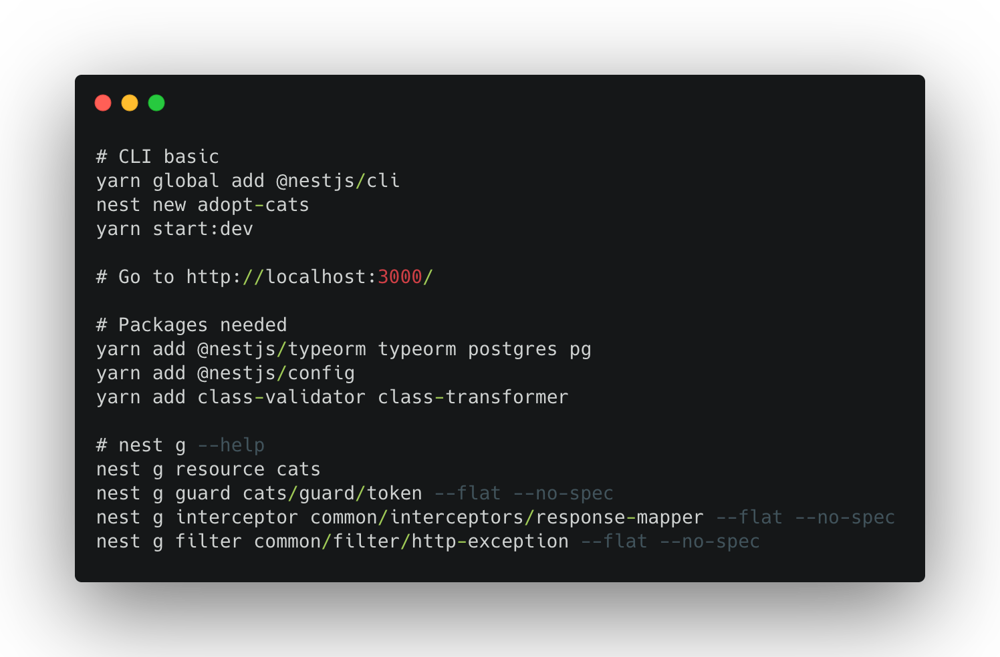

## Commands used for this project


## Description

Adopt-Cat App CRUD; example to highlight the use of pipes, guards, interceptors and filters in NestJs

## Installation

```bash
$ yarn install
```

## Running the app

```bash
# development
$ yarn start

# watch mode
$ yarn start:dev

# production mode
$ yarn start:prod
```

## Test

```bash
# unit tests
$ yarn test

# test coverage
$ yarn test:cov
```


## License

Nest is [MIT licensed](LICENSE).
